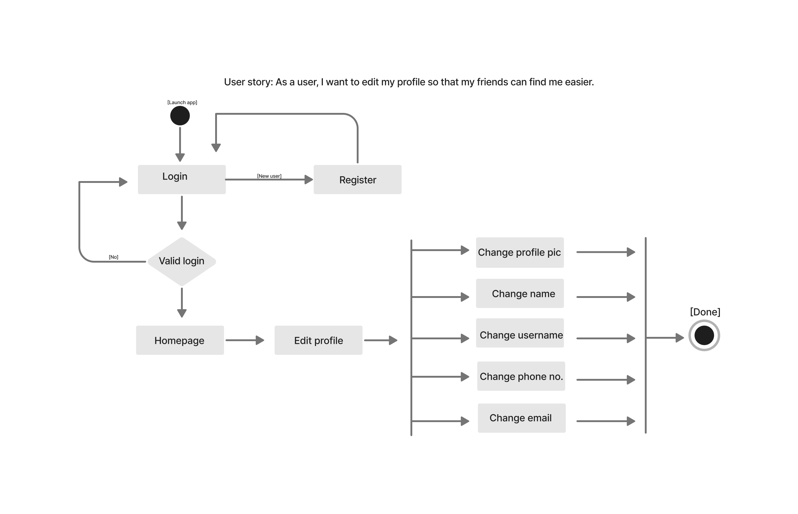
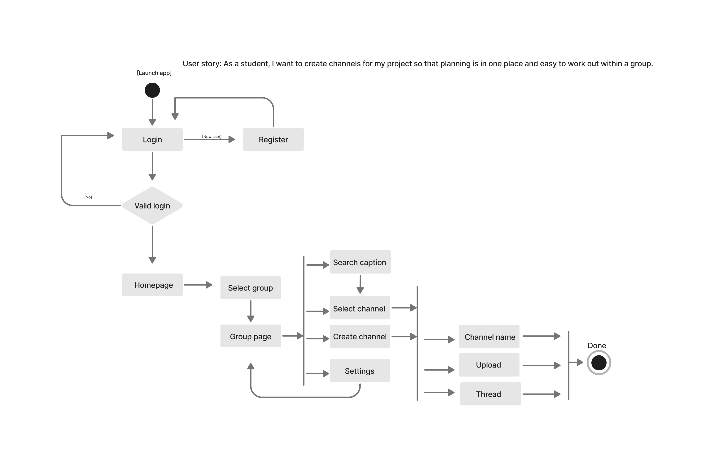
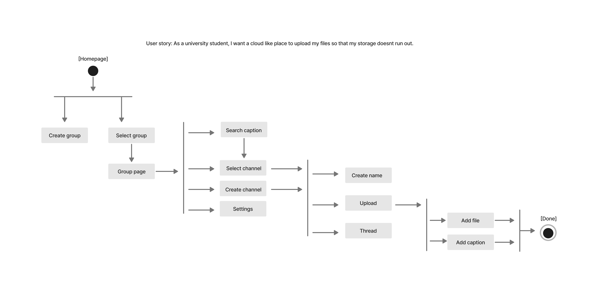

# Specification Phase Exercise

A little exercise to get started with the specification phase of the software development lifecycle. See the [instructions](instructions.md) for more detail.

## Team members

<a href="https://github.com/les5185"> Tiffany Lee   </a>
<a href="https://github.com/rachel0lehcar"> Rachel Andoh   </a>
<a href="https://github.com/elyazya"> Elyazya Al Kobaisa   </a>
<a href="https://github.com/mishaseo"> Misha Seo  </a>

## Stakeholders

### Brian Park, a student at NYU 

#### Goals/needs:

1. Save memories such as photos, videos, and text in a space shared with my friends and family. 
2. Categorize these memories into groups for easy storage and access. 
3. Keep in contact with my friends and family abroad and let them know how I am doing. 
4. Be able to see how my little sister is doing and how well she is growing up. 
5. Be able to find and look back at memories easily without spending too much time organizing a drive or photo album. 

#### Problems/Frustrations

1. Hard to find memories from my photo album since they are all stacked together.
2. Hard to organize memories on alternative platforms like Google Drive or Dropbox.
3. Alternative platforms such as Dropbox do not allow captions or texts on photos or videos. 
4. Hard to add each person to each Drive and make groups for each memory.
5. Alternative platforms such as Instagram or Facebook are mostly for public groups. 

### Jenna Al Enazi, a student at Goldsmiths University of London

#### Goals/Needs

1. Be able to save photos, videos, docs etc. with my friends and family while offline. 
2. Have easy to use edit functionalities, such as easily accessible shortcuts to different templates. 
3. Have it be user friendly for family and friends of all ages.
4. Be able to easily undo an upload or edit. 

#### Problems/Frustrations 

1. Difficulty sorting my images/docs in a time efficient way (organizational issues).
2. Most applications with similar functionalities to this platform can be visually loud, making it difficult to use.
3. Other platforms do not work offline, so some miss out. 
4. Templates are not often provided, which can make editing difficult for those with no editing skills (all ages). 

## Product Vision Statement
A mobile application where friends and family can create private groups for sharing memories or the activities of their daily lives.

## User Requirements

1. As a university student, I want to keep up with those from my home country so that I am connected to them without having to communicate via calls/texts.
2. As a user, I want to edit my profile so that my friends can find me easier.
3. As a grandmother, I want a centralized area where I can share memories I have collected over the years, so that I can look back at life.  
4. As an older brother, I want a more private app so that I can see how my younger sister is doing in a more safe environment where she will not be exposed to the usual side effects of social media.
5. As a student, I want to create channels for my project, so that planning is in one place and easy to work out within a group. 
7. As a user, I want to comment in a thread so that I can share my opinion and converse with group members.
9. As a user, I want a private platform with my friends so so that I can keep up with them without the noise from random posts and opinions of the public.
10. As a person who is part of very different social groups, I want to control the privacy of the group so that I can accommodate group member preferences.
11. As a university student, I want a cloud-like place to upload my files so that my storage does not run out.
12. As a family member, I want to be able to let my family know my thoughts about the photos they collect so that we can connect and react to them together.

## Activity Diagrams

Click diagrams for better view.

#### UML 1

As a user, I want to edit my profile so that my friends can find me easier.

#### UML 2

As a user, I want to control the group settings so that the group is public to the world.

#### UML 3 

As a user, I want to create a new channel in a group so that everything is organized and easy to find.

## Clickable prototype
Here is a link to the clickable prototype: 
<a href="https://www.figma.com/proto/S0IjBli2c8KWGsw6zeHadl/Untitled?node-id=4%3A150&scaling=scale-down&page-id=0%3A1&starting-point-node-id=4%3A150&show-proto-sidebar=1"> Clickable Prototype   </a>
